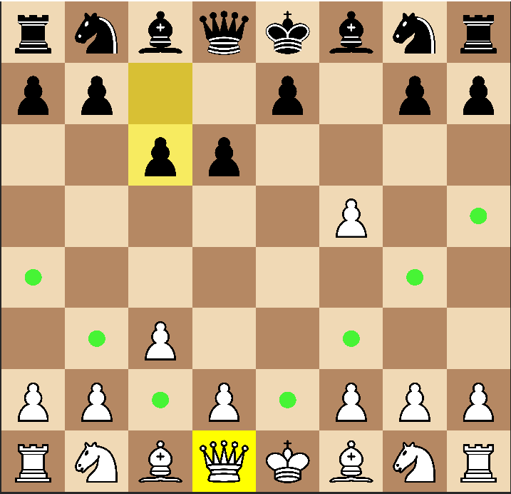
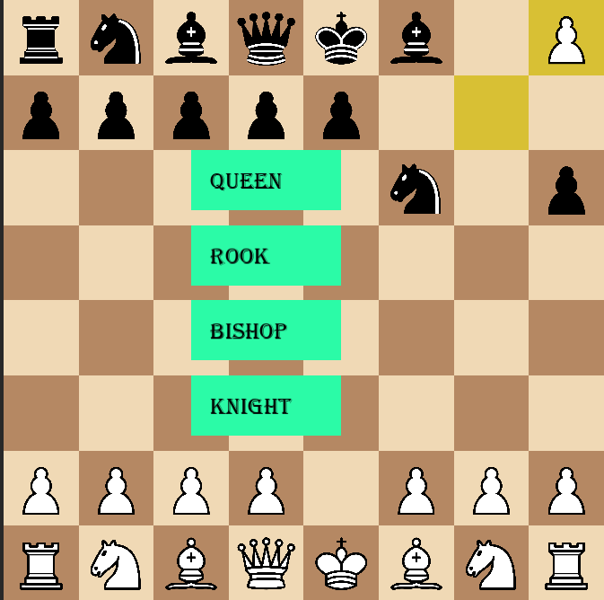
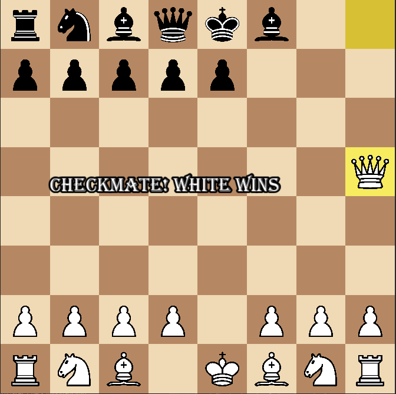

# ♟️ Chess Game in C++ and SFML

A complete Chess Game developed using **C++** and **SFML**, implementing all major chess rules along with an AI opponent powered by the **Minimax Algorithm with Alpha-Beta Pruning**.

The project was built with a strong focus on **Object-Oriented Programming (OOP)** concepts, game logic design, and AI-based decision making.

---

## Features

### Core Chess Rules
- ✅ Legal move validation for all pieces
- ✅ Check detection
- ✅ Checkmate detection
- ✅ Stalemate detection
- ✅ Castling
- ✅ En Passant
- ✅ Pawn Promotion

### User Interface
- ✅ Interactive graphical board using SFML
- ✅ Piece selection using mouse clicks
- ✅ Legal move highlighting
- ✅ Last move highlighting
- ✅ Game over screen
- ✅ Responsive board scaling

### Artificial Intelligence
- ✅ Human vs Human mode
- ✅ Human vs Computer mode
- ✅ Minimax Algorithm
- ✅ Alpha-Beta Pruning
- ✅ Automatic move evaluation and search

---

## Download and Run

1. Go to the **Releases** section of this repository.
2. Download the latest release (`Chess-Game-v1.0.zip`).
3. Extract the ZIP file.
4. Ensure that both:

   * `chess.exe`
   * `assets/` folder

   remain in the same directory.
5. Run `chess.exe` to start the game.

**Note:** The game requires the `assets` folder to load piece images and other resources correctly.

---

## Object-Oriented Programming Concepts Used

This project was designed using OOP principles to keep the code modular, maintainable, and extensible.

### Encapsulation
Each class manages its own data and behavior.

Examples:
- `Board`
- `Renderer`
- `Game`
- `Piece`

### Inheritance
All chess pieces inherit from a common base class.

```cpp
Piece
├── Pawn
├── Knight
├── Bishop
├── Rook
├── Queen
└── King
```

### Polymorphism

Different chess pieces implement their own version of:

```cpp
getLegalMoves()
```

through virtual functions.

### Abstraction

The game logic interacts with pieces through the base `Piece` class without needing to know the exact piece type.

---

## Project Structure

```text
Chess-Game
│
├── assets/
│   ├── whitePawn.png
│   ├── blackPawn.png
│   └── ...
│
├── Board.cpp
├── Board.h
├── Piece.h
├── Pawn.cpp
├── Knight.cpp
├── Bishop.cpp
├── Rook.cpp
├── Queen.cpp
├── King.cpp
│
├── Renderer.cpp
├── Renderer.h
│
├── AI.cpp
├── AI.h
│
└── main.cpp
```

---

## AI Implementation

The computer opponent uses:

### Minimax Algorithm

The AI explores possible future moves and assumes that both players play optimally.

### Alpha-Beta Pruning

To improve performance, unnecessary branches of the search tree are skipped.

This allows the AI to search deeper positions while maintaining reasonable response times.

---

## Technologies Used

- C++
- SFML 3.1
- Object-Oriented Programming
- Minimax Algorithm
- Alpha-Beta Pruning
- STL (Vectors, Maps, etc.)

---

## Learning Outcomes

Through this project I gained practical experience with:

- Object-Oriented Design
- Inheritance and Polymorphism
- Game Development
- GUI Programming using SFML
- Search Algorithms
- Artificial Intelligence in Games
- Data Structures and Algorithms
- Software Architecture

---

## Screenshots


### Game Board



### Promotion Menu



### Checkmate Screen



---

## Future Improvements

- Stronger AI evaluation function
- Opening book support
- Move history panel
- Undo/Redo functionality

---

## Author

Keshav Raj
